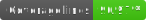
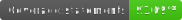
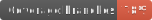
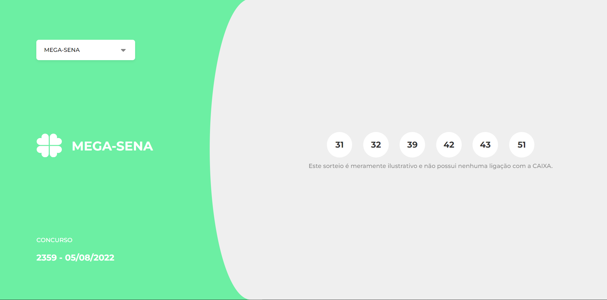
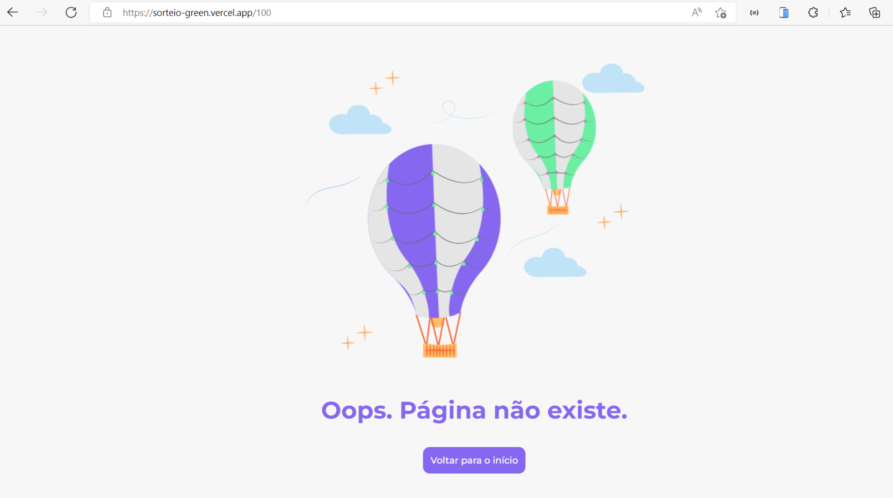
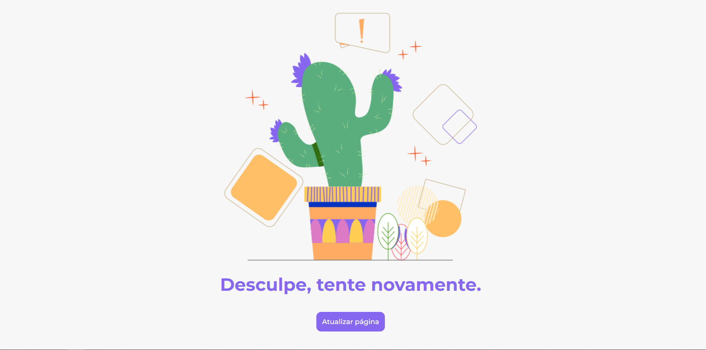
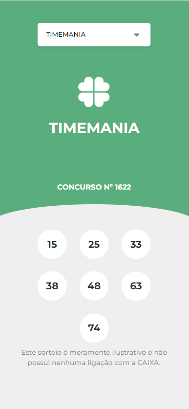

<div align="center">
  
  <h1 align="center">Plataforma de Sorteio</h1>
</div>

## 💻 Projeto

O objetivo é construir uma **aplicação web front-end** que mostre os **Resultados das Loterias**.
Veja o projeto [aqui](https://sorteio-green.vercel.app/)

<br/>

---

## 🚀 Tecnologias

Esse projeto foi desenvolvido com as seguintes tecnologias:

- ReactJS
- Typescript
- Styled Components
- React Testing Library
  <br/>

---

## 💻 Requerimentos

- Certifique-se de ter o [Node.js](https://nodejs.org/pt-br/) instalado.
  <br />

---

## 🏃‍♀️ Executando localmente

```bash
  # Clone o repositório
  $ git clone git@github.com:plmsz/frontend-challange-react.git

  # Acesse a pasta do projeto, ex:
  $ cd sorteio

 # Instale as dependências
  $ npm install

 # Execute a aplicação
  $ npm start
 # Acesse em <http://localhost:3000>
```

<br/>

---

## 🧪 Testes

<div align="center">
  
  
  
  
<div />
<br/>

---

### Executando os testes

- Para executar todos os testes execute o comando `npm run test`
- Para ver a cobertura do projeto execute o comando `npm run test:coverage`
- O relatório de cobertura será gerado dentro de `coverage/lcov-report/index.html`

## Features que implementei além do desafio

- Componente de loading
- Redirecionamento pata tela de erro pelo interceptor do axios

## 📱 Telas

<div align="center">
  
</div>
<div align="center">
  
</div>
<div align="center">
  
</div>
<div align="center">
  
</div>
<div align="center">
  
</div>

<br/>

---

## 🔖 Informações do desafio original

Você pode visualizar todas as informações sobre o desafio [aqui](./instrucao.md)

<br/>

---

> 💬 **Nota**
> A aplicação obteve um score em média de 95 em acessibilidade no Lighthouse, devido ao baixo contraste dos textos em alguns componentes. Optei no momento por manter as cores escolhidas pelo designer do desafio original.

<br/>

---

## 📫 Você pode me contatar em:

<div align="center">

</div>

</br>

[](https://www.linkedin.com/in/plmsz/)
[](mailto:plmsouzaoliveira@gmail.com)
[](https://twitter.com/plmszdev)
</span>